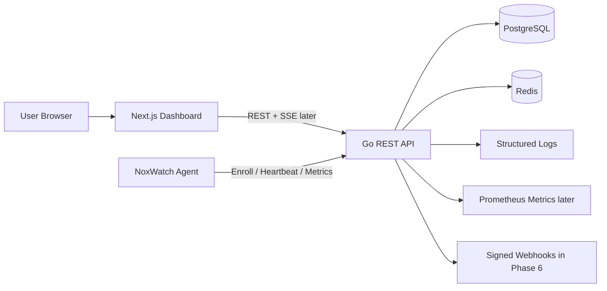
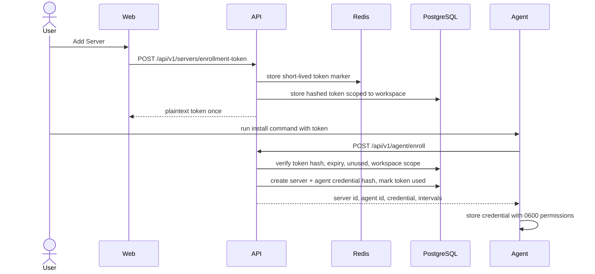
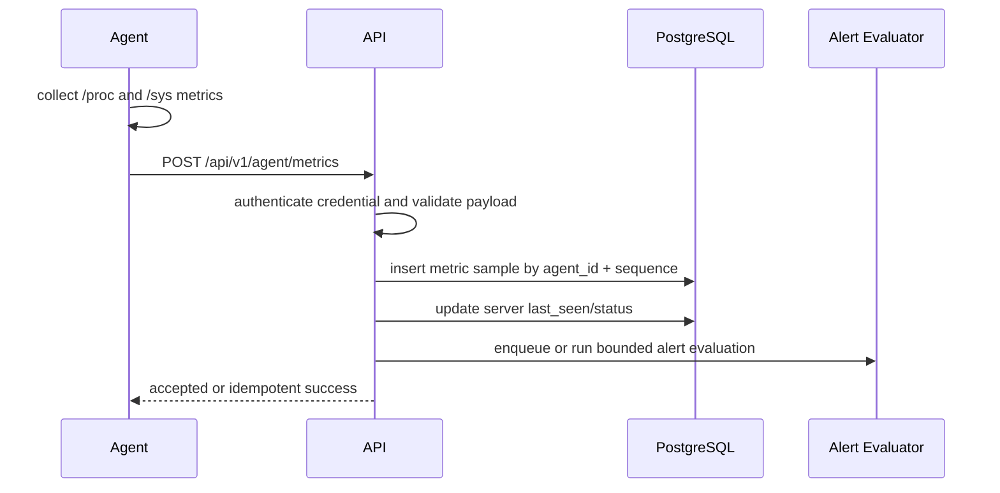
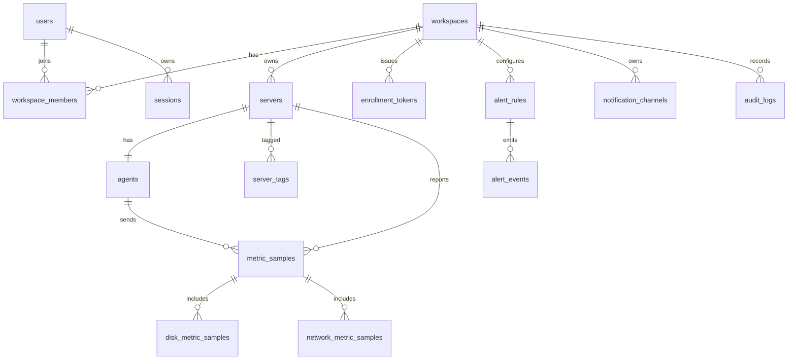

# NoxWatch Architecture

NoxWatch is an agent-based Linux server monitoring platform. The MVP registers a server with a short-lived enrollment token, issues a revocable agent credential, ingests heartbeat and metrics over outbound HTTPS, and shows workspace-scoped infrastructure health in a dashboard.

## 1. Product Architecture

- `apps/web`: Next.js App Router dashboard, Tailwind CSS, shadcn-style primitives, TanStack Query, Recharts, Lucide icons.
- `apps/api`: Go REST API, PostgreSQL persistence, Redis for ephemeral tokens/rate limits/jobs, structured `slog` logging, health/readiness endpoints.
- `agent`: Go Linux agent, outbound-only HTTPS, systemd service, local protected credential file, retry/backoff and bounded buffering.
- `migrations`: PostgreSQL schema migrations.
- `deployments`: Docker and systemd assets.

Phase 1 intentionally ships only the foundation. Auth, enrollment, metrics, alerting, and notifications are planned phases until implemented and tested.

## 2. System Component Diagram



## 3. Agent Enrollment Flow



## 4. Metrics Ingestion Flow



## 5. Database Entity Overview



Core query indexes are workspace/status for servers, server/time for metrics, workspace/time for metrics and audit logs, and workspace/state for alert events.

## 6. API Route List

| Method | Route | Phase | Notes |
| --- | --- | --- | --- |
| GET | `/health` | 1 | Liveness, no dependencies. |
| GET | `/ready` | 1 | Checks PostgreSQL and Redis. |
| POST | `/api/v1/auth/register` | 2 | Generic auth errors and rate limit. |
| POST | `/api/v1/auth/login` | 2 | Secure password verification. |
| POST | `/api/v1/auth/refresh` | 2 | Revocable refresh sessions. |
| POST | `/api/v1/auth/logout` | 2 | Session revocation. |
| GET/POST | `/api/v1/workspaces` | 2 | Workspace list/create. |
| GET | `/api/v1/workspaces/:workspaceId` | 2 | Membership-scoped access. |
| GET | `/api/v1/servers` | 3 | Workspace-scoped list. |
| POST | `/api/v1/servers/enrollment-token` | 3 | One-time short-lived token. |
| GET/PATCH/DELETE | `/api/v1/servers/:serverId` | 3-5 | Server detail/update/delete. |
| GET | `/api/v1/servers/:serverId/metrics` | 5 | Bounded historical range. |
| GET | `/api/v1/servers/:serverId/metrics/latest` | 5 | Latest sample. |
| GET | `/api/v1/servers/:serverId/alerts` | 6 | Server alert history. |
| POST | `/api/v1/agent/enroll` | 3 | Token exchange for agent credential. |
| POST | `/api/v1/agent/heartbeat` | 4 | Credential-authenticated heartbeat. |
| POST | `/api/v1/agent/metrics` | 4 | Credential-authenticated ingestion. |
| GET/POST | `/api/v1/alert-rules` | 6 | Workspace/server alert rules. |
| PATCH/DELETE | `/api/v1/alert-rules/:ruleId` | 6 | Alert rule changes. |

## 7. Security Threat Overview

- Account enumeration: generic register/login responses and rate limits.
- Credential theft: password/token/agent credential hashes in storage; plaintext returned only at creation.
- Token replay: enrollment tokens expire, are one-time use, revocable, scoped to a workspace, and invalidated in a transaction.
- Tenant escape: every protected query is scoped by workspace membership or agent ownership.
- Agent spoofing: metrics and heartbeat verify the credential belongs to the submitted server.
- Injection: parameterized SQL and server-side validation.
- Sensitive logging: request logs exclude passwords, auth headers, tokens, and full metric payloads.
- CSRF/XSS/CORS: secure cookies where used, CSRF for cookie auth, strict CORS allowlist, security headers, React escaping.
- Retry abuse: bounded body sizes, rate limits, strict timeouts, idempotent metrics by agent sequence.
- Unsafe remote control: no browser terminal, SSH password storage, remote shell, or arbitrary command execution in the MVP.

## 8. Repository Structure

```text
noxwatch/
├── AGENTS.md
├── apps/
│   ├── api/
│   └── web/
├── agent/
├── deployments/
│   ├── docker/
│   ├── scripts/
│   └── systemd/
├── docs/
├── migrations/
├── packages/
├── docker-compose.yml
├── Makefile
├── .env.example
└── README.md
```

Some directories are introduced when their phase starts. Empty scaffolding is avoided until code needs it.

## 9. Implementation Plan

1. Foundation: config validation, logging, health/readiness, Docker Compose, migrations, dashboard shell, docs.
2. Auth/workspaces: registration, login, refresh/logout, owner workspace creation, workspace isolation tests.
3. Enrollment: token generation, hashed token storage, install command UI, agent enrollment endpoint.
4. Agent/ingestion: Linux metrics collector, heartbeat, metrics API, credential storage and revocation.
5. Dashboard: server list, detail, latest metrics, historical charts, live status updates.
6. Alerting/notifications: alert rules, lifecycle, cooldown/deduplication, signed webhook channel.
7. Hardening: audit logs, rate limits, retention job, authorization review, production docs.

## 10. MVP vs Future Features

MVP:

- User auth, workspace ownership, workspace isolation.
- Secure one-time server enrollment.
- Linux agent heartbeat and CPU/RAM/disk/network/uptime metrics.
- Backend-determined online/offline status.
- Current and historical metrics dashboard.
- Basic alert rules, firing/resolved lifecycle, webhook notifications.
- Revocable user sessions and agent credentials.
- Docker Compose local development and automated critical tests.

Future:

- Docker and systemd monitoring, uptime checks, SSL checks, log collection.
- Public status pages, incident timelines, scheduled maintenance.
- Kubernetes, Windows agent, mobile notifications.
- Signed agent auto-update, mTLS, SSO, SCIM, advanced RBAC.
- Data export, public API, API keys, Terraform provider.
